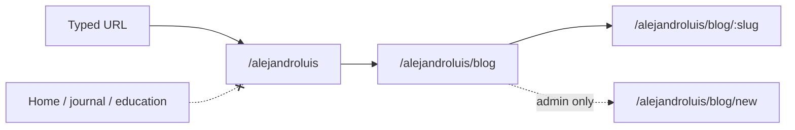

# Personal site at `/alejandroluis`

Same origin as Detox Mental (`www.detoxmental.es`). A separate product surface: visitors only reach it by URL (or a link you share). Nothing in the journal or education modules points here.

`/alejandroluis` is a quiet personal landing. `/alejandroluis/blog` lists articles. `/alejandroluis/blog/:slug` is one article. You publish from an unlisted composer that only an `admin` account can use.

## Product rules

- **Inbound isolation.** No button, menu item, footer, toast, or in-copy link in Home, journal, education, onboarding, account, login, or promo may target `/alejandroluis`.
- **Own chrome.** Blog pages do not render product `Navigation`. No home icon to `/`, no THEORY / COURSE / JOURNAL links, no language switcher, no login/account entry in the public blog UI.
- **Outside the education gate.** Register these routes next to Home/journal, not under `OnboardingGate`, so a first-time visitor is not sent to onboarding.
- **Public read, admin write.** Anyone with the URL can read published posts. Creating, editing, and seeing drafts requires `users.role = 'admin'` on the server. The SPA only reveals Write / Edit when `user.role === 'admin'`.
- **English-first copy through the locale catalogs.** Blog chrome, filters, form labels, and status text live in [`en.js`](frontend/src/data/locales/en.js) and [`es.js`](frontend/src/data/locales/es.js) as `blog.*` keys and are read with `useLocale()`'s `t()`. English is `DEFAULT_LOCALE`. Article bodies stay as authored (the seeded posts remain in Spanish). Code, comments, prompts, schema, and API names stay English.
- **Markdown bodies.** Reuse `react-markdown` (already used in onboarding and tests). No new CMS or editor dependency.
- **No product leakage the other way either, on the public surface.** The landing and blog do not advertise Education, Journal, or Account. (You already know `/login` if you need to sign in as admin.)



## Routes

| Path | Who | Screen |
| --- | --- | --- |
| `/alejandroluis` | public | Personal landing: name, one-line intro, single **Blog** control |
| `/alejandroluis/blog` | public | Chronological list of published posts (title, date, category, excerpt), filterable by `?category=` |
| `/alejandroluis/blog/new` | admin | Composer (create) |
| `/alejandroluis/blog/:slug` | public | Article reader |
| `/alejandroluis/blog/:slug/edit` | admin | Composer (edit) |

Unknown slugs and unpublished slugs (for non-admins) render a simple not-found state on the blog chrome, not the education 404 / onboarding flow.

Admin compose URLs are unlisted: they are not in public navigation. Non-admins hitting them see the same not-found state (do not advertise “you must be admin”).

## Why a database composer (not files in the repo)

“A place where I can upload articles when I need to” is an in-app write path, not a deploy. Static markdown in `src/data/` would require a commit and Vercel deploy per post. A hosted CMS would add a vendor. PostgreSQL already stores product content; `users.role` already includes `admin`.

V1 posts are **text + markdown**. No image blob storage (journal images are already in-memory-only). Optional later: markdown image URLs to existing `public/` files or external hosts.

## Aesthetic

Match Detox Mental without borrowing other pages’ CSS classes or the product hamburger.

Reuse tokens from [`frontend/src/index.css`](frontend/src/index.css): `--background` `#F4F2F0`, `--accent` `#845d43`, `--primary` `#2d3142`, `--text` `#22223b`, Montserrat, 16px radius buttons, `--shadow`.

| Screen | Visual reference | Own BEM prefix |
| --- | --- | --- |
| Landing | [`Home`](frontend/src/Pages/Home/Home.jsx): full-viewport, letter-spaced title, one large rounded CTA | `alejandro-home` |
| Index | [`JournalHistory`](frontend/src/Pages/JournalHistory/JournalHistory.jsx): 640px column, accent titles, dated cards, empty state | `blog-index` |
| Article | [`Article.css`](frontend/src/Pages/Article/Article.css): ~1.15rem / 1.7 line-height, accent blockquotes, centered title + subtitle, generous padding | `blog-post` |
| Composer | Journal textarea + Account-style panels: title, slug, excerpt, markdown body, draft/publish, save | `blog-composer` |

Shared blog shell (name → landing, Blog → index; admin Write) lives in `Components/BlogChrome/`, used only by these pages. Copy the look into each owner stylesheet; do not import `Article.css` or `Journal.css`.

Landing copy: title **Alejandro Luis**, one short intro line, button **BLOG**, localized through `blog.*` catalog keys. No Detox Mental wordmark on this screen (the domain already carries the product; this surface is personal).

## Backend

New domain module, not journal:

```text
backend/src/blogPosts/
├── blogPosts.controller.js
├── blogPosts.service.js
└── parseBlogPost.js          # slug, title, excerpt, body, category, status
```

**Schema.** [`backend/src/db/migrations/014_blog_posts.sql`](backend/src/db/migrations/014_blog_posts.sql):

```sql
CREATE TABLE blog_posts (
    id UUID PRIMARY KEY DEFAULT uuid_generate_v4(),
    slug VARCHAR(120) NOT NULL UNIQUE,
    title VARCHAR(200) NOT NULL,
    excerpt TEXT NOT NULL DEFAULT '',
    body TEXT NOT NULL,
    category VARCHAR(40) NOT NULL,
    status VARCHAR(20) NOT NULL DEFAULT 'draft',
    author_id UUID REFERENCES users(id) ON DELETE SET NULL,
    published_at TIMESTAMP WITH TIME ZONE,
    created_at TIMESTAMP WITH TIME ZONE NOT NULL DEFAULT NOW(),
    updated_at TIMESTAMP WITH TIME ZONE NOT NULL DEFAULT NOW(),
    CONSTRAINT blog_posts_status_check CHECK (status IN ('draft', 'published')),
    CONSTRAINT blog_posts_category_check CHECK (category IN ('personal-development', 'technology')),
    CONSTRAINT blog_posts_slug_format CHECK (slug ~ '^[a-z0-9]+(?:-[a-z0-9]+)*$'),
    CONSTRAINT blog_posts_title_not_empty CHECK (LENGTH(TRIM(title)) > 0),
    CONSTRAINT blog_posts_body_not_empty CHECK (LENGTH(TRIM(body)) > 0)
);
```

Index `published_at DESC` for the public list (`WHERE status = 'published'`) and `category` for `?category=` filters. Reuse `update_updated_at_column()`. Document in [`backend/src/db/README.md`](backend/src/db/README.md). Migration 014 also seeds the two initial published articles (one per category); there is no frontend mock catalog.

**Auth.** Add `requireAdmin` next to [`requireAuth`](backend/src/auth/auth.middleware.js): after `req.user` is loaded, `req.user.role !== 'admin'` → **404** (same “does not exist” as a missing post; do not return 403 that confirms an admin API). Public GETs have no auth.

**HTTP.** Mount at `/blog` in [`backend/src/index.js`](backend/src/index.js) (not under `/auth/me`; these are not user-owned journal resources).

| Method | Path | Auth | Behavior |
| --- | --- | --- | --- |
| GET | `/blog/posts` | public | Published only: `{ id, slug, title, excerpt, category, publishedAt }` newest first. Optional `?category=` (`personal-development` \| `technology`) |
| GET | `/blog/posts/:slug` | public | Full published post; 404 if draft or missing |
| GET | `/blog/admin/posts` | admin | All posts including drafts |
| GET | `/blog/admin/posts/:slug` | admin | Full post including drafts |
| POST | `/blog/admin/posts` | admin | Create; 201; unique slug |
| PATCH | `/blog/admin/posts/:slug` | admin | Update fields; republish/unpublish; 404 if missing |
| DELETE | `/blog/admin/posts/:slug` | admin | Delete; 204 |

On first publish, set `published_at = NOW()` if it was null; unpublish sets `status = 'draft'` and leaves `published_at` for history (public list still filters on `status`). Map rows to camelCase in the service.

**Validation** in `parseBlogPost.js` (tested): trim title; slug lowercase hyphenated `[a-z0-9-]+`, length cap; body non-empty; category `personal-development | technology`; status `draft | published`; excerpt optional, cap ~500 chars. Duplicate slug → 409.

Set your account to `admin` in each environment (`UPDATE users SET role = 'admin' WHERE email = '...';`). There is no in-app role picker.

## Frontend

Register in [`frontend/src/App.jsx`](frontend/src/App.jsx) **outside** `OnboardingGate`:

```text
/alejandroluis
/alejandroluis/blog
/alejandroluis/blog/new
/alejandroluis/blog/:slug
/alejandroluis/blog/:slug/edit
```

Put `new` before `:slug` so it is not captured as a slug.

Pages (one folder each, per frontend structure rules):

- `Pages/AlejandroLuis/` — landing
- `Pages/Blog/` — index
- `Pages/BlogPost/` — reader (`ReactMarkdown`, loading / empty / error / not-found)
- `Pages/BlogComposer/` — create/edit; redirect/not-found unless `status === 'ready' && user?.role === 'admin'`

`Components/BlogChrome/` — header used by Blog, BlogPost, BlogComposer (and optionally the landing). Write / Edit only if admin.

`frontend/src/utils/blogSlug.js` — client slug suggestion from title (same rules as the server). Tests colocated. Category slugs live in `frontend/src/data/blogCategories.js`; labels live in the locale catalogs as `blog.category.<slug>`.

`apiFetch` for all blog requests (cookie sent automatically when you are signed in). Public GETs still work anonymous. The database (seeded by migration 014) is the only source of articles; there is no offline mock fallback. The index sends `?category=` when a known category is selected and treats unknown query values as “all”. Admins load `GET /blog/admin/posts` so drafts are reachable from the index.

**Composer fields:** title, slug (auto from title until edited), category, excerpt, markdown body, status (draft / published), save. Success → `/alejandroluis/blog/:slug/edit` for drafts and `/alejandroluis/blog/:slug` for published posts. Keyboard: primary save button is a real `<button type="submit">`.

**Empty index:** a short localized line that there are no articles in this category. No CTA into Detox Mental.

**Loading / error:** inline status text in the blog chrome, with retry where a fetch failed. Do not reuse the product toast host.

Do **not** change [`navigationModules.js`](frontend/src/data/navigationModules.js), [`Home.jsx`](frontend/src/Pages/Home/Home.jsx), [`Navigation.jsx`](frontend/src/Components/Navigation/Navigation.jsx), Account, or journal/education pages except if a test needs to prove the absence of `/alejandroluis`.

## Isolation tests (non-negotiable)

Observable behavior:

- Home still has exactly Education and Journal; neither navigates to `/alejandroluis`.
- Navigation on `/journal` and `/theory` still has no Blog / Alejandro control.
- `App` blog routes are not children of `OnboardingGate`.
- Blog chrome has no control whose accessible name or `href` is a product module path (`/`, `/journal`, `/theory`, `/course`, `/account`, `/login`).
- Public `GET /blog/posts` never includes `status: 'draft'`.
- Non-admin `POST /blog/admin/posts` is 401 (no cookie) or 404 (signed-in free/paid).
- Admin can create a draft that is absent from the public list and 404 on the public slug GET, then publish and see it on the index and article page.

## Docs

Update [`.cursor/docs/architecture.md`](.cursor/docs/architecture.md): `/alejandroluis` as a third, unlinked surface; `/blog` API; `requireAdmin`. Do not edit `DECISIONS.md`. README overview can mention the personal blog URL in one line.

**Handoff:** apply `014` on each environment; set your user `role` to `admin`. No new env vars.

## Out of scope (v1)

- RSS, SEO meta beyond default SPA title, comments, free-form tags, covers, image upload. Fixed `personal-development` / `technology` categories shipped in v1; free-form tags did not.
- Blog-specific login page or post-login redirect into the composer
- Linking Detox Mental from the blog (or the reverse)
- Promoting `/alejandroluis` from magic-link landing (`/?auth=success` stays Home)

## Acceptance criteria

**Success.** Typing `/alejandroluis` shows a personal landing in Detox Mental colors with one Blog control. `/alejandroluis/blog` lists published articles. Opening one shows markdown rendered in the long-form article rhythm. An admin signed in with the existing magic link can open `/alejandroluis/blog/new`, save a draft, publish, and see the post live without a deploy.

**Empty.** Index with zero published posts shows an empty state, not a product module.

**Auth.** Logged-out and non-admin users cannot create posts; compose routes look like not-found. Writes are rejected by the API even if the SPA is bypassed.

**Isolation.** From Home, journal, and education, there is no control that reaches this site.

**Persistence.** Published posts survive reload; drafts stay off the public list.
